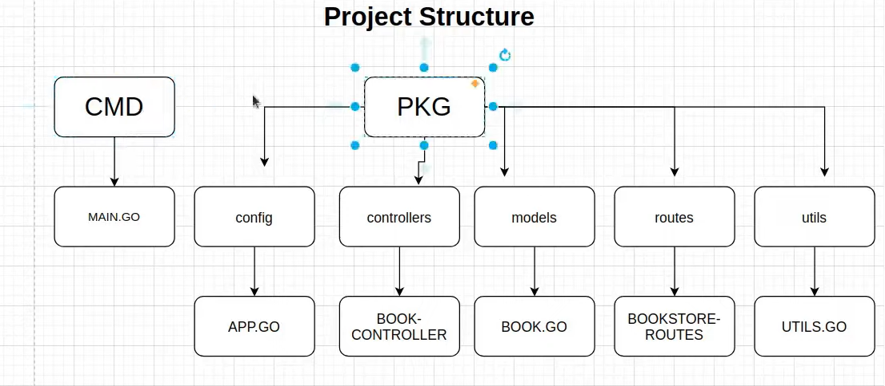
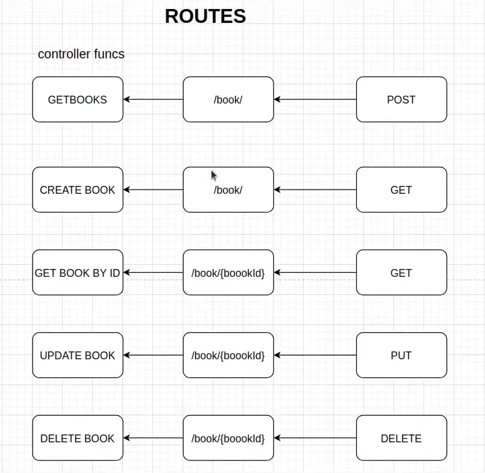

# 'Golang Bookstore Management System: CRUD API with MySQL and Gorilla Mux

## 2️⃣ Overview of the project
 The Golang Bookstore Management System project aims to develop a robust and efficient CRUD (Create, Read, Update, Delete) API in Go language for managing bookstore records. The system utilizes popular packages such as Gorm for MySQL interaction and Gorilla Mux for routing, offering a beginner-friendly approach to understanding these technologies.

## 3️⃣ Library Imports


1. **Database Interaction with Gorm:**
```go
import (
    "github.com/jinzhu/gorm"
    _ "github.com/jinzhu/gorm/dialects/mysql"
)
```
   - We'll use the Gorm package, which is an ORM (Object-Relational Mapping) framework for Go, to interact with a MySQL database. Gorm simplifies database operations by abstracting away the complexities of SQL queries, allowing us to work with Go structs instead of raw SQL.

2. **JSON Marshaling and Unmarshaling:**
```go
import (
    "encoding/json"
)
```
   - JSON marshaling refers to the process of converting Go structs into JSON format, while unmarshaling is the reverse process of converting JSON data into Go structs. These techniques are essential for handling data serialization and deserialization when sending and receiving HTTP requests and responses in JSON format.

3. **Routing with Gorilla Mux:**
```go
import (
    "github.com/gorilla/mux"
)
```
   - Gorilla Mux is a powerful HTTP router for Go, enabling us to define URL patterns and map them to handler functions. With Gorilla Mux, we can easily handle complex routing scenarios, including route parameters, query parameters, and nested routes. It simplifies the process of routing requests to the appropriate controller functions.

## 4️⃣ Project Structure


   - The project follows a structured layout to organize code effectively. It consists of two main folders:
 1. **CMD Folder:**
   - Create a folder named `CMD`.
   - Inside the `CMD` folder, create another folder named `main`.
   - Inside the `main` folder, create the `main.go` file.

2. **Package Folder:**
   - Create a folder named `Package`.
   - Inside the `Package` folder, create the following subfolders:
     - `Config`
     - `Controllers`
     - `Models`
     - `Routes`
     - `Utils`

3. **Config Folder:**
   - Inside the `Config` folder, create the `app.go` file.

4. **Controllers Folder:**
   - Inside the `Controllers` folder, create the `controller.go` file.

5. **Models Folder:**
   - Inside the `Models` folder, create the `book.go` file.

6. **Routes Folder:**
   - Inside the `Routes` folder, create the `bookstore_routes.go` file.

7. **Utils Folder:**
   - Inside the `Utils` folder, create the `utils.go` file.

## 5️⃣ Routes 

   - The API consists of several endpoints for performing CRUD (Create, Read, Update, Delete) operations on book records:
a. **GET /book:**
   - Endpoint for retrieving all books from the database.
   - Corresponding controller function: `getBooks`.

b. **POST /book:**
   - Endpoint to create a new book.
   - Requires sending book details in the request body.
   - Corresponding controller function: `createBook`.

c. **GET /book/{id}:**
   - Endpoint to fetch a specific book by its ID.
   - Requires specifying the book ID in the URL path.
   - Corresponding controller function: `getBookByID`.

d. **PUT /book/{id}:**
   - Endpoint to update an existing book.
   - Requires specifying the book ID in the URL path and sending updated book details in the request body.
   - Corresponding controller function: `updateBook`.

e. **DELETE /book/{id}:**
   - Endpoint to delete a book by its ID.
   - Requires specifying the book ID in the URL path.
   - Corresponding controller function: `deleteBook`.

By utilizing these components and adhering to the project structure, we ensure a well-organized and maintainable codebase for our Bookstore Management System API.


## 6️⃣ `bookstore-routes` file inside the `routes` folder

1. **Importing Packages:**
   ```go
   import (
       "github.com/gorilla/mux"
       "github.com/active/good/bookstore/pkg/controllers"
   )
   ```
   - Here, `mux` is imported to handle routing, while `controllers` is imported to access the controller functions.

2. **Registering Routes:**
   - The next step is to define and register the routes using `gorilla/mux`.
   - The `router := mux.NewRouter()` line initializes a new router instance.

   ```go
  var RegisterBookstoreRoutes = func(router *mux.Router)  {
    

    // Handle POST request to create a new book
    router.HandleFunc("/book/", controllers.CreateBook).Methods("POST")

    // Handle GET request to retrieve all books
    router.HandleFunc("/book/", controllers.GetBooks).Methods("GET")

    // Handle GET request to retrieve a specific book by ID
    router.HandleFunc("/book/{bookId}", controllers.GetBookByID).Methods("GET")

    // Handle PUT request to update an existing book
    router.HandleFunc("/book/{bookId}", controllers.UpdateBook).Methods("PUT")

    // Handle DELETE request to delete a book by ID
    router.HandleFunc("/book/{bookId}", controllers.DeleteBook).Methods("DELETE")

    
 }
   ```

   - Each `HandleFunc` call specifies a route, a corresponding controller function, and the HTTP method associated with that route.
   - For example, `router.HandleFunc("/book", controllers.CreateBook).Methods("POST")` registers a route for creating a new book. When a POST request is made to `/book`, it calls the `CreateBook` function from the `controllers` package.

3. **Function to Register Routes:**
   - Finally, a function named `registerBookstoreRoutes` is defined to encapsulate the route registration process.
   - This function returns the configured router instance, which can be used to serve HTTP requests.

4. **Usage of Absolute Paths:**
   - In Go, absolute import paths are used, which may initially seem verbose compared to relative paths used in some other languages like Node.js.
   - For example, `"github.com/active/good/bookstore/pkg/controllers"` is an absolute import path pointing to the `controllers` package in the project.

5. **Route Handling Logic:**
   - Each route is associated with a specific controller function defined in the `controllers` package.
   - The controller functions contain the business logic for handling requests and generating responses related to the corresponding route.

By following this approach, the code achieves a clear separation of concerns, with route definitions handled separately from the controller logic. This promotes modularity, readability, and maintainability of the codebase.


## 7️⃣ `app.go` file inside the `config` folder

Here's the code for the `app.go` file inside the `config` folder, along with an explanation of each part:

```go
package config

import (
    "github.com/jinzhu/gorm"
    _ "github.com/jinzhu/gorm/dialects/mysql"
)

var DB *gorm.DB

func Connect() {
    var err error
    DB, err = gorm.Open("mysql", "username:password@tcp(localhost:3306)/database_name?charset=utf8&parseTime=True&loc=Local")
    if err != nil {
        panic(err)
    }
}

func GetDB() *gorm.DB {
    return DB
}
```

Explanation:

Sure, let's break down the code for `app.go` in the `config` package and explain each part in more detail:

1. **Package Declaration:**
   - `package config`: This line at the top of the file indicates that this file belongs to the `config` package, which is a part of your project's package structure.

2. **Import Statements:**
   - `import "github.com/jinzhu/gorm"`: This line imports the Gorm package, which is an ORM (Object-Relational Mapping) library for Go. It provides functionalities for interacting with databases.
   - `import _ "github.com/jinzhu/gorm/dialects/mysql"`: This line imports the MySQL dialect for Gorm. The underscore `_` before the import is used to import the package solely for its side effects, such as registering the MySQL dialect with Gorm. It allows Gorm to communicate with MySQL databases.

3. **Global Variable:**
   - `var DB *gorm.DB`: This line declares a global variable `DB` of type `*gorm.DB`, which will hold the connection to the MySQL database. It will be accessible from other files within the `config` package.

4. **Connect Function:**
   - `func Connect()`: This function is responsible for establishing a connection with the MySQL database.
   - Inside the function, `gorm.Open()` is called to open a connection to the MySQL database. The function takes two parameters: the database driver ("mysql") and the connection string. The connection string contains information such as the username, password, host, port, and database name.
   - If an error occurs during the connection process, it is assigned to the `err` variable. If `err` is not `nil`, indicating an error, the program panics and exits, displaying the error message.

5. **GetDB Function:**
   - `func GetDB() *gorm.DB`: This function returns the global `DB` variable, allowing other files in the project to access the database connection.
   - When called, it simply returns the `DB` variable.

6. **Additional Database Configuration:**
   - After the connection string in the `Connect()` function, there are additional parameters required by MySQL:
     - `charset=utf8`: Specifies the character set to use, which is UTF-8 in this case.
     - `parseTime=True`: Enables Gorm to automatically parse time values from the database into Go `time.Time` objects.
     - `loc=Local`: Sets the time zone location to local time.

Overall, this `app.go` file serves as the configuration for establishing and managing the connection to the MySQL database. It provides functions to connect to the database (`Connect()`) and retrieve the database connection (`GetDB()`) for performing database operations in other parts of the application.


Here's the code for the `utils.go` file in the `utils` package, along with an explanation of each part:

```go
package utils

import (
    "encoding/json"
    "io/ioutil"
    "net/http"
)

func ParseBody(r *http.Request, x interface{}) {
    if body, err := ioutil.ReadAll(r.Body); err == nil {
        if err := json.Unmarshal([]byte(body), x); err != nil {
            return
        }
    }
}
```

Explanation:

1. **Package Declaration:**
   - `package utils`: This line declares that this file belongs to the `utils` package.

2. **Import Statements:**
   - `import "encoding/json"`: Imports the `encoding/json` package, which provides functions for encoding and decoding JSON data.
   - `import "io/ioutil"`: Imports the `io/ioutil` package, which provides utilities for working with input/output operations, such as reading from and writing to files.
   - `import "net/http"`: Imports the `net/http` package, which provides HTTP client and server implementations.

3. **ParseBody Function:**
   - `func ParseBody(r *http.Request, x interface{})`: Defines a function named `ParseBody` that takes two parameters: `r`, which is a pointer to an `http.Request` object representing the incoming HTTP request, and `x`, which is an empty interface that will hold the parsed JSON data.
   - Inside the function, it attempts to read the entire body of the HTTP request using `ioutil.ReadAll(r.Body)`. This reads the request body and returns a byte slice containing the body content (`body`) and an error (`err`). If there's no error (`err == nil`), it proceeds with JSON unmarshaling.
   - It then attempts to unmarshal the JSON data (`[]byte(body)`) into the provided empty interface `x` using `json.Unmarshal()`. If there's an error during unmarshaling, it returns immediately.
   - If any error occurs during the process, such as reading the request body or unmarshaling JSON, the function exits without modifying the `x` parameter.

Overall, the `ParseBody` function in the `utils` package simplifies the process of parsing JSON request bodies from incoming HTTP requests. It reads the request body, unmarshals the JSON data into a provided empty interface, and handles any errors that may occur during the process. This utility function can be reused throughout the project to parse JSON request bodies in a consistent and efficient manner.

In Go, an interface is a type that specifies a set of method signatures. It defines a contract that a concrete type must fulfill by implementing all the methods defined by the interface. Interfaces provide a way to achieve polymorphism and decouple the implementation from the interface definition, allowing for more flexible and modular code.

In the `ParseBody` function, we use an empty interface (`interface{}`) as the type of the `x` parameter. An empty interface in Go can hold values of any type because it has no methods defined. This allows us to pass any type of value to the `ParseBody` function, making it more flexible and reusable.

Here's why we're using an interface in this context:

1. **Flexibility**: By accepting an empty interface, the `ParseBody` function can handle JSON data of any structure or type. It doesn't need to know the specific type of data being parsed, making it more versatile.

2. **Decoupling**: The use of an interface decouples the parsing logic from the concrete types of data being parsed. This separation of concerns allows for cleaner code organization and easier maintenance.

3. **Polymorphism**: Using an interface enables polymorphism, allowing different types of JSON data to be parsed using the same function signature. This simplifies code reuse and promotes consistency across different parts of the application.

Overall, using an interface in the `ParseBody` function enhances flexibility, decouples implementation details, and promotes polymorphism, leading to more modular and maintainable code.


Here's the code for the `book.go` file inside the `models` package, along with an explanation of each part:

```go
package models

import (
    "github.com/jinzhu/gorm"
    "github.com/akhil/go-bookstore/bookstore/pkg/config"
)

var DB *gorm.DB

type Book struct {
    Name        string `gorm:"column:name" json:"name"`
    Author      string `gorm:"column:author" json:"author"`
    Publication string `gorm:"column:publication" json:"publication"`
}

func init() {
    config.Connect()
    DB = config.GetDB()
    DB.AutoMigrate(&Book{})
}
```

Explanation:

1. **Package Declaration:**
   - `package models`: Declares that this file belongs to the `models` package.

2. **Import Statements:**
   - Imports necessary packages:
     - `github.com/jinzhu/gorm`: Imports the Gorm package for ORM functionalities.
     - `github.com/akhil/go-bookstore/bookstore/pkg/config`: Imports the `config` package from the project, which provides database connectivity.

3. **Global Variable:**
   - `var DB *gorm.DB`: Declares a global variable `DB` of type `*gorm.DB`, which will hold the database connection.

4. **Book Struct:**
   - Defines a struct named `Book` representing the model for books in the database.
   - It has three fields: `Name`, `Author`, and `Publication`, each tagged with `gorm` and `json` tags to specify column names and JSON field names, respectively.

5. **Init Function:**
   - `func init()`: Defines an initialization function that will be automatically executed when the package is imported.
   - Inside the function:
     - It calls `config.Connect()` to establish a connection with the database using the configuration defined in the `config` package.
     - It retrieves the database connection using `config.GetDB()` and assigns it to the global `DB` variable.
     - It calls `DB.AutoMigrate(&Book{})` to automatically migrate the `Book` struct to the database schema, ensuring that the `books` table (corresponding to the `Book` struct) is created or updated based on the struct definition.

This `book.go` file serves as the model for the `Book` entity in the application's database. It initializes the database connection and ensures that the necessary database schema modifications are applied using Gorm's auto-migration feature.


Here's the code for the `main.go` file, along with an explanation of each part:

```go
package main

import (
    "log"
    "net/http"

    "github.com/gorilla/mux"
    _ "github.com/jinzhu/gorm/dialects/mysql"
    "github.com/monster0freason/golang-bookstore-management-system/pkg/routes"
)

func main() {
    r := mux.NewRouter()

    // Register bookstore routes
    routes.RegisterBookstoreRoutes(r)

    // Handle functions using controllers
    http.Handle("/", r)

    // Create server
    log.Fatal(http.ListenAndServe("localhost:9010", r))
}
```

Explanation:

1. **Package Declaration:**
   - `package main`: Declares that this file is part of the `main` package, indicating that it is an executable program.

2. **Import Statements:**
   - Imports necessary packages:
     - `"log"`: Imports the standard Go package for logging.
     - `"net/http"`: Imports the standard Go package for HTTP server functionalities.
     - `"github.com/gorilla/mux"`: Imports the Gorilla Mux package for HTTP request routing.
     - `"_ "github.com/jinzhu/gorm/dialects/mysql"`: Imports the MySQL dialect for Gorm, allowing Gorm to interact with MySQL databases. The underscore `_` before the import indicates that we only want to import the package for its side effects (i.e., registering the MySQL dialect with Gorm) without directly referencing it in our code.
     - `"github.com/akhil/go-bookstore/package/routes"`: Imports the `routes` package from the project, which contains route definitions.

3. **Main Function:**
   - `func main()`: Defines the entry point of the program.
   - Inside the function:
     - Creates a new instance of the Gorilla Mux router using `mux.NewRouter()` and assigns it to the variable `r`.
     - Registers the bookstore routes by calling `routes.RegisterBookstoreRoutes(r)`, passing the router `r`.
     - Handles functions using controllers by passing the router `r` to `http.Handle("/", r)`, which sets up the router to handle all incoming HTTP requests.
     - Creates the server using `http.ListenAndServe("localhost:9010", r)`. This function starts an HTTP server listening on port 9010 of the localhost. If an error occurs during server startup, it logs the error and exits using `log.Fatal()`.

This `main.go` file serves as the entry point of the application. It initializes the router, registers routes, and starts the HTTP server to handle incoming requests. It ensures that the application follows a structured approach to handling HTTP requests and maintains separation of concerns by defining routes in a separate package.


package models

import (
    "github.com/jinzhu/gorm"
    "github.com/monster0freason/golang-bookstore-management-system/pkg/config"
)

var db *gorm.DB

type Book struct {
    Name        string `gorm:"column:name" json:"name"`
    Author      string `gorm:"column:author" json:"author"`
    Publication string `gorm:"column:publication" json:"publication"`
}

func init() {
    config.Connect()
    db = config.GetDB()
    db.AutoMigrate(&Book{})
}


// CreateBook creates a new book in the database
func (b *Book)CreateBook() *Book {
    db.NewRecord(b)
    db.Create(&b)
    return b
}

// GetAllBooks retrieves all books from the database
func GetAllBooks() []*Book {
    var Books []*Book
    db.Find(&Books)
    return Books
}

// GetBookByID retrieves a book from the database by its ID
func GetBookByID(Id int64) (*Book, *gorm.DB) {
    var getBook Book
    db := db.Where("ID = ?", Id).Find(&getBook)
    return &getBook, db
}

// DeleteBook deletes a book from the database by its ID
func DeleteBook(ID int64) Book {
    var book Book
    db.Where("ID = ?", ID).Delete(book)
    return book
}
Certainly! Let's delve deeper into the internal workings of each function, starting with `CreateBook()` and then moving on to the others:

1. **CreateBook() Function:**
   - `CreateBook()` is a method attached to the `Book` struct, making it a method of that struct.
   - When calling `CreateBook()`, it operates on a specific instance of a `Book` struct.
   - The function takes no parameters because it operates on the receiver, which is denoted by `(b *Book)`. This means it's invoked on a specific `Book` instance.
   - The `db` object used inside `CreateBook()` is a global variable initialized in the `init()` function. It represents the database connection.
   - Before creating a new record in the database, Gorm checks if the book `b` is a new record by calling `db.NewRecord(b)`. This is a Gorm method that checks if a given struct is a new record (i.e., not yet saved to the database).
   - If `b` is indeed a new record, `db.Create(&b)` is called to create the book record in the database. The `&b` syntax is used to pass the address of the `b` variable, allowing Gorm to modify it directly.
   - After creating the record, the function returns a pointer to the created book (`return b`). This allows the caller to access the created book's properties or use it further in the application.

2. **GetAllBooks() Function:**
   - `GetAllBooks()` retrieves all books from the database without any filters.
   - Inside the function, a slice named `Books` of type `*Book` is declared. This slice will hold pointers to `Book` structs retrieved from the database.
   - `db.Find(&Books)` is used to fetch all records from the `books` table in the database and store them in the `Books` slice. Gorm populates the slice with the retrieved records.
   - The function then returns the `Books` slice containing pointers to all retrieved books.

3. **GetBookByID() Function:**
   - `GetBookByID()` retrieves a book from the database by its ID.
   - It takes the `ID` of the book as an input parameter.
   - Inside the function, a variable named `getBook` of type `Book` is declared to store the retrieved book.
   - `db.Where("ID = ?", Id).Find(&getBook)` is used to query the database for the book with the specified ID. Gorm retrieves the book and populates the `getBook` variable with its data.
   - The function then returns a pointer to the `getBook` variable and a pointer to a `gorm.DB` object representing the database operation result.

4. **DeleteBook() Function:**
   - `DeleteBook()` deletes a book from the database by its ID.
   - It takes the `ID` of the book as an input parameter.
   - Inside the function, a variable named `book` of type `Book` is declared to store the deleted book.
   - `db.Where("ID = ?", ID).Delete(book)` is used to delete the book with the specified ID from the database. Gorm performs the deletion operation.
   - The function then returns the `book` variable, which may contain the deleted book's data (although it's not used in this case).

In summary, these functions encapsulate database operations related to the `Book` model. They leverage Gorm's ORM capabilities to interact with the database, providing an abstraction layer that simplifies database access and management.


package controllers

import (
    "encoding/json"
    "fmt"
    "net/http"
    "strconv"

    "github.com/monster0freason/golang-bookstore-management-system/pkg/models"
    "github.com/monster0freason/golang-bookstore-management-system/pkg/utils"
    "github.com/gorilla/mux"
)

// GetBooks handles the retrieval of all books from the database.
func GetBooks(w http.ResponseWriter, r *http.Request) {
    newBooks := models.GetAllBooks() // Retrieve all books from the database
    res, _ := json.Marshal(newBooks)
    w.Header().Set("Content-Type", "application/json")
    w.WriteHeader(http.StatusOK)
    w.Write(res)
}

// GetBookByID retrieves a book from the database by its ID.
func GetBookByID(w http.ResponseWriter, r *http.Request) {
    vars := mux.Vars(r)
    bookID := vars["bookId"]
    ID, err := strconv.ParseInt(bookID, 10, 64) // Assuming bookId is of type int64
    if err != nil {
        fmt.Println("Error while parsing:", err)
        return
    }

    bookDetails, _ := models.GetBookByID(ID)
    res, _ := json.Marshal(bookDetails)
    w.Header().Set("Content-Type", "application/json")
    w.WriteHeader(http.StatusOK)
    w.Write(res)
}

// CreateBook creates a new book in the database.
func CreateBook(w http.ResponseWriter, r *http.Request) {
    newBook := &models.Book{}
    utils.ParseBody(r, newBook)

    createdBook := newBook.CreateBook()
    res, _ := json.Marshal(createdBook)
    w.Header().Set("Content-Type", "application/json")
    w.WriteHeader(http.StatusCreated)
    w.Write(res)
}

// UpdateBook updates an existing book in the database.
func UpdateBook(w http.ResponseWriter, r *http.Request) {
    var updateBook models.Book
    utils.ParseBody(r, &updateBook)

    vars := mux.Vars(r)
    bookID := vars["bookId"]
    ID, err := strconv.ParseInt(bookID, 10, 64) // Assuming bookId is of type int64
    if err != nil {
        fmt.Println("Error while parsing:", err)
        return
    }

    bookDetails, db := models.GetBookByID(ID)
    if updateBook.Name != "" {
        bookDetails.Name = updateBook.Name
    }
    if updateBook.Author != "" {
        bookDetails.Author = updateBook.Author
    }
    if updateBook.Publication != "" {
        bookDetails.Publication = updateBook.Publication
    }
    db.Save(&bookDetails)
    res, _ := json.Marshal(bookDetails)

    w.Header().Set("Content-Type", "application/json")
    w.WriteHeader(http.StatusOK)
    w.Write(res)
}

// DeleteBook deletes a book from the database by its ID.
func DeleteBook(w http.ResponseWriter, r *http.Request) {
    vars := mux.Vars(r)
    bookID := vars["bookId"]
    ID, err := strconv.ParseInt(bookID, 10, 64) // Assuming bookId is of type int64
    if err != nil {
        fmt.Println("Error while parsing:", err)
        return
    }

    deletedBook := models.DeleteBook(ID)
    res, _ := json.Marshal(deletedBook)
    w.Header().Set("Content-Type", "application/json")
    w.WriteHeader(http.StatusOK)
    w.Write(res)
}


Let's break down each function in detail and explain its purpose and workings:

1. **GetBooks**:
   - This function handles the retrieval of all books from the database.
   - It takes an `http.ResponseWriter` and an `http.Request` as parameters.
   - Inside the function, it calls the `GetAllBooks()` function from the `models` package, which retrieves all books from the database.
   - The retrieved books are then marshaled into JSON format using `json.Marshal()`.
   - The JSON response is written to the response writer along with setting the appropriate content type and status code.

2. **GetBookByID**:
   - This function retrieves a specific book from the database by its ID.
   - It takes an `http.ResponseWriter` and an `http.Request` as parameters.
   - It extracts the book ID from the request URL using `mux.Vars(r)`.
   - The extracted ID is then converted to an integer using `strconv.ParseInt()` assuming the book ID is of type `int64`.
   - It calls the `GetBookByID()` function from the `models` package to retrieve the book details.
   - The retrieved book details are marshaled into JSON format and written to the response writer along with setting the appropriate content type and status code.

3. **CreateBook**:
   - This function creates a new book in the database.
   - It takes an `http.ResponseWriter` and an `http.Request` as parameters.
   - It initializes a new empty `models.Book` struct.
   - It parses the request body into the newly created book struct using the `utils.ParseBody()` function.
   - It calls the `CreateBook()` method of the `models.Book` struct to save the newly created book to the database.
   - The created book is marshaled into JSON format and written to the response writer along with setting the appropriate content type and status code.

4. **UpdateBook**:
   - This function updates an existing book in the database.
   - It takes an `http.ResponseWriter` and an `http.Request` as parameters.
   - It initializes a new `models.Book` struct to hold the updated book details.
   - It parses the request body into the update book struct using `utils.ParseBody()`.
   - It extracts the book ID from the request URL using `mux.Vars(r)`.
   - The extracted ID is converted to an integer using `strconv.ParseInt()`.
   - It calls the `GetBookByID()` function from the `models` package to retrieve the book details by ID.
   - It updates the book details if new values are provided in the request body.
   - The updated book details are saved to the database using `db.Save(&bookDetails)`.
   - The updated book details are then marshaled into JSON format and written to the response writer along with setting the appropriate content type and status code.

5. **DeleteBook**:
   - This function deletes a book from the database by its ID.
   - It takes an `http.ResponseWriter` and an `http.Request` as parameters.
   - It extracts the book ID from the request URL using `mux.Vars(r)`.
   - The extracted ID is converted to an integer using `strconv.ParseInt()`.
   - It calls the `DeleteBook()` function from the `models` package to delete the book from the database by ID.
   - The deleted book details are marshaled into JSON format and written to the response writer along with setting the appropriate content type and status code.

These functions collectively provide the CRUD (Create, Read, Update, Delete) operations for managing books in the bookstore management system. They interact with the database through the models package and handle request and response formatting using the `http.ResponseWriter` and `http.Request` objects.